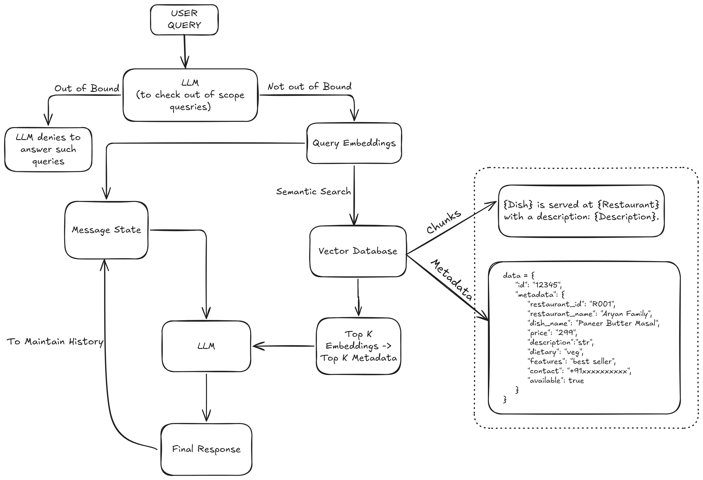

# Zomato Gen AI Internship Assignment

## Table of Contents

- [Web Scrapping](https://github.com/Sarthacker/zomato-rag?tab=readme-ov-file#web-scraping-process)
- [Knowledge Base Creation](https://github.com/Sarthacker/zomato-rag?tab=readme-ov-file#knowledge-base-creation)
- [RAG Workflow](https://github.com/Sarthacker/zomato-rag?tab=readme-ov-file#rag-workflow)
- [User Interface](https://github.com/Sarthacker/zomato-rag?tab=readme-ov-file#user-interface)
- [Demo Images](https://github.com/Sarthacker/zomato-rag?tab=readme-ov-file#user-interface)


## Web Scraping Process

### 1. Introduction

The following process presents a comprehensive account of the procedures and 
methodologies employed to automate data extraction from seven diverse restaurant 
websites. The primary goal of this initiative was to gather and organize 
critical information regarding each establishment and its menu offerings. 
This dataset will serve as the foundational element for constructing a 
robust knowledge base to enable analytics, recommendations, and further data-driven 
decision making.

### 2. Restaurant Selection

A strategic selection process was undertaken to identify seven restaurants that offer distinct culinary experiences and representative menu structures. The criteria for selection included:
- **Menu Diversity**: Establishments with a broad variety of menu items to test scraping logic on different categories.
- **Webpage Complexity**: Sites employing various layouts and dynamic elements to validate scraper resilience.
- **Geographical Spread**: A mix of local eateries and well-known chains to capture variations in site design.

The chosen restaurants include:

- Maashi Biryani World
- Manish Eating Point
- Kuduk Chicken
- Aryan Family Delight
- Moti Mahal Delux
- Burger King
- Dosa Planet

### 3. Data Collection Scope

This stage defined the specific attributes to extract at both the restaurant and menu item level, ensuring a comprehensive dataset:

#### - Restaurant-Level Attributes

- **Rating**: Customer review average, typically out of five stars.
- **Location**: Full address and geolocation coordinates when available.
- **Contact Information**: Phone numbers, email addresses, and reservation links.
- **Operating Hours**: Opening and closing times for each day of the week.
- **Menu Overview**: High-level categorization of dishes (e.g., appetizers, entrees, desserts).

#### - Dish-Level Attributes
Each menu item was further detailed with the following fields:

- **Name**: Official title of the dish as listed.
- **Price**: Listed price in local currency.
- **Description**: Brief textual description or ingredient list.
- **Rating**: Individual dish ratings where available.
- **Features**: Labels such as “chef’s special,” “most popular,” or “spicy.”
- **Dietary Classification**: Indicators for vegetarian, vegan, gluten-free, or other dietary categories.

### 4. Data Conversion to JSON

- Upon completion of data cleaning and validation, the consolidated dataset was serialized into JSON format for interoperability and ease of downstream consumption.
- Each restaurant entry was represented as an individual JSON object, encapsulating its metadata (rating, location, contact details, operating hours, and menu overview).
- Menu items for each restaurant were structured as a nested array of objects within the parent restaurant object, capturing all dish-level attributes (name, price, description, rating, features, and dietary classification).
- Python’s built-in json library was utilized to generate the output, with parameters set to produce human-readable indentation and ensure UTF-8 encoding compatibility.
### 5. Algorithm

```
Initialize browser session                     # Setup Selenium WebDriver and configure timeouts
For each restaurant in the list:               # Loop through all target restaurant URLs
    Navigate to restaurant info page           # Open webpage for metadata extraction
    Extract restaurant metadata                # Scrape name, location, contact, hours, and rating
    Navigate to restaurant menu page           # Open webpage for menu details
    Extract dish details                       # Scrape dish name, price, description, rating, features, and dietary info
    Clean and validate data                    # Apply cleaning functions to ensure consistency
    Store data in temporary structure          # Append cleaned info and menu to a list or dataframe
Serialize the complete dataset to JSON format  # Convert the collected list into a nested JSON file
Close browser session                          # Quit WebDriver and release resources
```
### 6. Flow Chart


### 7. Tools and Technologies

- **Selenium WebDriver**: Leveraged for automated browser control, enabling the handling of complex page interactions and dynamic content.
- **Explicit and Implicit Waits**: Configured to ensure all dynamic elements fully rendered before interaction, reducing data omission errors.
- **Python**: The primary scripting language used to orchestrate the scraping tasks and perform initial data cleaning.

### 8. Assumptions and Limitations

Several working assumptions guided the scraper development, along with acknowledged limitations:
- **Assumption**: Class names and HTML structures for analogous elements remained consistent within each site.
- **Limitation**: Occasional deviations in markup resulted in partial or incorrect captures, particularly on pages with frequent design updates.
- **Effect**: While most records were accurately captured, a small subset required manual verification or additional parsing rules.

### 9. Challenges Faced

- **Dynamic Content Loading**: Many pages implemented lazy loading or JavaScript-driven elements. Custom wait conditions and scrolling routines were added to ensure complete data retrieval.
- **Inconsistent HTML Structures**: Variations in container classes and element nesting across restaurants necessitated flexible selector definitions and fallback mechanisms.
- **Pop-up and Banner Obstructions**: Intermittent promotional overlays disrupted the scraping workflow. A utility was developed to detect and dismiss these elements before data extraction.

### 10. Conclusion and Next Steps

The web scraping process successfully produced a detailed dataset encompassing 
both restaurant-level metadata and granular dish information. Minor inconsistencies 
have been cataloged and addressed through targeted cleaning procedures. The subsequent 
phase involves ingesting this structured dataset into a knowledge base platform, 
defining entity relationships, and implementing query interfaces.

## Knowledge Base Creation

### 1. Text Chunking and Embedding Generation

Once the data is collected, the next step is converting raw text data into a machine-readable format suitable for semantic search and further analysis. This involves the creation of text chunks and the generation of embeddings.

- **Text Chunking**: Descriptive text is generated for each menu item by combining dish details and restaurant metadata. This forms a natural language representation of each dish.

- **Example**: 
    ```
    {Dish} is served at {Restaurant} with a description: {Description}.
    ```

- **Embedding Generation**: Text chunks are passed through a pre-trained model (BAAI/bge-base-en-v1.5) to generate vector embeddings.
- This model is trained on vast amounts of data and can generate embeddings that capture semantic relationships in text, making it suitable for tasks like semantic search, information retrieval, and context understanding.

These embeddings represent the semantic meaning of the text in a numerical format, which is useful for efficient comparison and search.

### 2. Storing Data in Pinecone (Indexing)
After generating embeddings, the next step is storing the data in a vector database for efficient querying. In this case, **Pinecone** is used as the database.

**Pinecone Indexing**:

- **Upsert**: The embeddings, along with associated metadata (restaurant name, dish name, description, price, dietary info, etc.), are upserted into Pinecone's index.

- **Metadata Storage**: Along with the embeddings, metadata such as dish names, descriptions, prices, operating hours, and dietary information are stored. This allows for rich querying, ensuring that the semantic search not only returns relevant vectors but also useful contextual data.
```
Exmaple of Metadata -

    data = {
        "id": "12345",
        "values": [0.25, 0.58, 0.77, 0.12, 0.45, 0.33],  # Example embedding values
        "metadata": {
            "restaurant_id": "R001",
            "restaurant_name": "Aryan Family Delight",
            "dish_name": "Paneer Butter Masal",
            "description": "Paneer cooked with onion and tomato in butter, adding to the aroma",
            "price": "299",
            "dietary": "veg",
            "operating_hours": "Weekdays - 10:00 AM to 9:00 PM Weekends - 11:00 AM to 10:00 PM",
            "features": "best seller",
            "contact": "+91xxxxxxxxxx",
            "available": true
        }
    }

```

- **Vector Representation**: Embeddings serve as the vector representations of the dishes, which allow for semantic search based on similarity rather than exact matches.

### 3. Semantic Search with Pinecone
The knowledge base is now stored as a vector space where each entry has a high-dimensional vector (embedding) representing its semantic meaning. Pinecone allows fast and efficient retrieval of similar items based on their embeddings.

- **Query Embedding Generation**: When a user inputs a query (e.g., "find vegan dishes"), the query is processed in the same way as the data. It is converted into an embedding using the same model.

- **Search Query Execution**: Pinecone uses its index to search for the closest embeddings to the query embedding, returning the most relevant results based on vector similarity.

- **Query Results**: The search results not only include the most semantically similar dishes but also include associated metadata (e.g., restaurant name, price, description).
### 4. Algorithm To Create Database
```
Load "restaurants.json" into memory                        # Read the JSON file containing restaurant and menu data
Initialize embedding model                                 # Load pre-trained SentenceTransformer model
Initialize Pinecone index                                  # Connect to Pinecone with API key and index name
For each restaurant object in JSON data:                   # Iterate restaurants
    Extract restaurant metadata (id, name, contact, hours)
    For each menu item in restaurant["menu"]:              # Iterate dishes
        If description is empty: continue                  # Skip items without text
        Build text chunk:                                  # Compose descriptive sentence for embedding
            "{dish} is served at {restaurant name} with description: {description}"
        Compute embedding from text chunk                  # Generate vector representation
        Prepare upsert payload with embedding and metadata
        Upsert payload into Pinecone index                 # Store vector in DB
Close Pinecone connection                                  # Finalize transmissions
```
### 5. Flow Chart


## RAG Workflow

### 1. Handle Out of Bound Query

   Send the user’s raw input to the Llama model along with a system prompt that explicitly limits its scope to:  
   - Food, restaurants, cuisines, menus, reservations  
   - Greeting phrases (e.g. “hi”, “hello”, “good morning”)  
   Anything outside those categories should be rejected.

### 2. Converting Text into Embeddings

The user's query is converted into a numerical representation called an embedding. This allows the model to compare and understand the semantic meaning of the text. Here's how it works:

- The input text is encoded into dense vectors by using (BAAI/bge-base-en-v1.5) model from Hugging Face.
- The vector represents the meaning of the text in a 768-dimensional space where semantically similar sentences are closer together.

### 3. Searching for Semantically Similar Vectors in the Vector Database

After converting the user query into an embedding, the next step is to find the most relevant context by searching for semantically similar vectors in the Pinecone vector database. This process is crucial for ensuring that the response is tailored to the specific food or restaurant-related question.

- **Vector Querying**  
   - The embedding generated from the user's query is used as the search vector. It is sent to Pinecone, which is a vector database optimized for similarity search.

- **Search Process**  
   - Pinecone performs a similarity search by comparing the user query’s embedding with embeddings of previously indexed restaurant data stored in the database.  
   - Pinecone used a metric called cosine similarity to measure how close the vectors are in the embedding space. The closer the vectors are, the more semantically similar the text is.

- **Top-K Results**  
   - Pinecone returns the top-k most relevant matches, based on the similarity score.
   - These results will include metadata such as the restaurant name, dish names, prices, and descriptions.

- **Context for Further Processing**  
   - The retrieved search results are then further used as the context as history for generating a more accurate and personalized response to the user's query.
### 4. Algorithm
```
Load system prompt for scope-checking                       # System prompt allows only food, restaurants, cuisines, menus, reservations, greetings
Initialize Llama model with scope-check prompt              # Pre-load Llama weights and tokenizer
Receive raw_user_input                                      # Get user’s question

Send raw_user_input + scope-check prompt to Llama           # Ask Llama to classify or answer only if within allowed categories
If Llama’s classification is out of bound                   # Llama flags anything outside food, restaurants, cuisines, menus, reservations, or greetings
    Respond NEGATIVE  
    Exit workflow                                           # Stop further processing

Initialize embedding model                                  # Load pre-trained Hugging Face model
embedding_model.encode(user_input)                          # 768-dimensional vector representing the user’s question
                                                            

Initialize Pinecone client with API key and index name      # Connect to vector DB
results = Pinecone.query(                                   # Perform similarity search
    vector = query_embedding,  
    top_k = K,                                              # Number of nearest neighbors
    metric = "cosine"                                       # Use cosine similarity  
)
For each hit in results:                                    # Iterate over top-K matches
    Extract metadata:                                       # Retrieve stored restaurant data
        restaurant_name = hit.metadata["name"]
        dish_name       = hit.metadata["dish"]
        price           = hit.metadata["price"]
        description     = hit.metadata["description"]
    Append formatted_context:                               # Build a text snippet for each match
        "{dish_name} at {restaurant_name}: 
         {description} (${price})"

Compose retrieval_context = join(formatted_context_list)    # Merge snippets into one block
Build final_prompt:                                         # Instruct Llama to answer using the retrieved context
    system: “Use ONLY the following context to 
    answer questions about food and restaurants.”
    context: retrieval_context
    user: raw_user_input
Send final_prompt to Llama                                  # Ask for a tailored response
Receive final_response from Llama                           # Llama generates answer
Return final_response                                       # Send back to user

Close Pinecone connection                                   # Clean up resources
```
### 5. Flow Chart


### 6. Conclusion 
- The main function here is processing of the user query by running through the steps sequentially: checking query relevance, converting to embeddings, searching the vector database, and generating a response.

## User Interface

### 1. Requirements
Before running the chatbot, make sure you have the following installed:

- Python 3.7+
- **Streamlit**: For creating the web interface.
- **Dependencies**: The project relies on certain Python libraries. These should be installed via a requirements file.

### 2. Setup Instructions
- Clone this repository to your local machine:
```
git clone "https://github.com/Sarthacker/zomato-rag.git"
cd zomato-rag
```
- Create and Activate a Virtual Environment (Optional)
```
python -m venv venv
source venv/bin/activate  # On Windows, use `venv\Scripts\activate`
```
- Install the Required Dependencies
```
pip install -r requirements.txt
```
- Alternatively, if a `requirements.txt` file does not exist, install the following dependencies manually:
```
pip install streamlit
```
- Run the Streamlit Application
```
streamlit run app.py
```
- After running the command, Streamlit will start a local server. Open the URL provided in the terminal, usually `http://localhost:8501/` in your browser to access the chatbot.

## Demo Images


